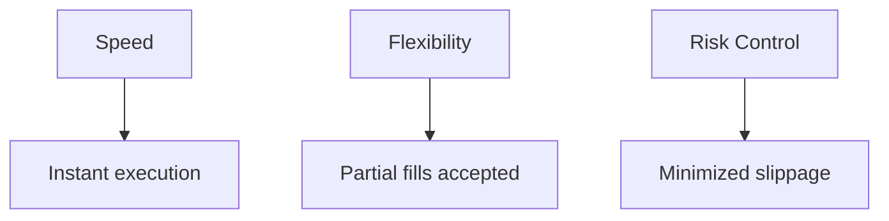
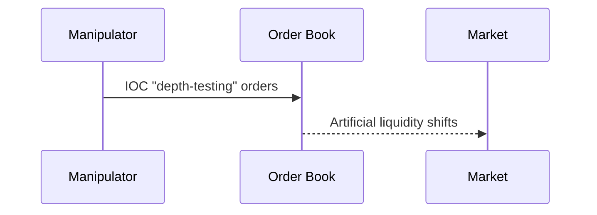

# Order Types in Trading

## Understanding Order Type in The CryptoCurrency Market

## 📘 Introduction

<aside>
💡

The cryptocurrency market is a high-stakes game where every move counts — picking the right **order type** can make or break trades.

As a trader deeply focused on **high-frequency trading (HFT)** and **volume-based indicators** like:

- Volume delta
- Order book imbalance

  https://quantpedia.com/how-to-use-deep-order-flow-imbalance/

- Market inflows

…I’ve learned that **mastering order types is key** to outsmarting the market chaos on platforms like Binance.

Whether I’m:

✅ Scalping quick 1% moves on SOL

✅ Dodging whale manipulations like spoofing

…the way I place orders directly shapes my **profits, risks, and speed**.

In this document, I dive deep into every major **order type in the crypto market**, explaining:

- What they are
- How they work
- When to use them
- Pros and cons
- How they interact with market dynamics


</aside>

## 📝 Market Order

<aside>
💡

A **market order** is an instruction to **buy or sell a cryptocurrency immediately at the best available price in the order book**.

### 📊 How it works

- On Binance, for example, I place a market order to buy **10 SOL**.
- The order executes instantly at the lowest **ask price** (e.g., $150.10), even if it needs to fill across multiple orders to complete.
- I often use market orders for **scalping fast 1% moves in 24 hours**, especially when **volume delta shows a +5,000 SOL spike**, where speed matters more than precise price control.

---

### ✅ Advantages

- **Guaranteed execution**, no matter how volatile the market is.
- Crucial during **volatile pumps**, e.g., catching a 3% DOGE surge in 72 hours.

---

### ⚠️ Disadvantages

- **Slippage:** You might pay $150.20 instead of $150.10 if liquidity is thin.
- **Taker fees:** Binance charges a 0.1% taker fee on market orders.
- **Eats into liquidity:**
    - Tightens spreads slightly (+0.01%), but also spikes prices in low-depth markets.
- **Vulnerable to spoofing:** Fake orders can mislead you into hitting unfavorable prices before they’re pulled.

---

### 🛠️ Summary

Market orders are a **blunt but fast tool** — great when speed is more important than price precision. They’re indispensable for scalping and reacting to sudden moves but can be **costly if misused**, especially in thin or manipulated markets.

</aside>

## 📝 Limit Order

<aside>
💡

A **limit order** allows you to set a specific price to **buy or sell a cryptocurrency**, and it executes only when the market hits that price.

---

### 📊 How it works

- On Binance, for example, I place a **limit order** to buy **10 ETH at $3,000**.
- The order sits in the **order book** until it’s either filled or canceled.
- I use limit orders mainly for **swing trades**, e.g., targeting a **10% pump in 288 hours**, placing buys at **volume profile support** like $3,000.

---

### ✅ Advantages

- Saves on fees:
    - Avoids Binance’s **0.1% taker fee**
    - Charges a lower **0.075% maker fee**
- Provides **price control** — you only buy/sell at your chosen price.
- Avoids **slippage**, unlike market orders.
- Adds liquidity to the market:
    - E.g., widens order book depth by $30,000 for a 10 ETH order.

---

### ⚠️ Disadvantages

- No guaranteed execution:
    - If ETH never hits $3,000, the order stays unfilled.
    - Risk of missing fast moves like a **5% pump in 144 hours**.
- Vulnerable to spoofing:
    - Fake limit orders by others can mislead you, though my **order book scripts** help detect them.
</aside>

## 📝 Stop-Limit Order

<aside>
💡

A **stop-limit order** triggers a **limit order** to buy or sell **once the market hits a stop price**, setting a specific execution price.

---

### 📊 How it works

- Example: On Binance, I set a **stop-limit order** to sell **20 AVAX at a $30 limit** if the price drops to **$31**.
- This protects me against a **5% dump in 192 hours**.
- I often use it to limit **losses in HFT scalps**, e.g., exiting a long when **volume delta turns negative (-5,000 AVAX)**.

---

### ✅ Advantages

- Provides **price control** and avoids slippage (if filled).
- Charges a lower **maker fee (0.075%)**, same as limit orders.
- Adds liquidity once triggered — supporting order book depth.
- Solid tool for **risk management** in volatile conditions.

---

### ⚠️ Disadvantages

- May not execute if the price **gaps past $30**, e.g., during a **10% crash in 384 hours**, or if the dump is too fast.
- Vulnerable to **stop hunts**, where spoofers push prices to trigger stops — I mitigate this by monitoring **order book imbalances**.
- Timing can be tricky; improper placement might lead to missed exits.

---

### 🛠️ Summary

Stop-limit orders combine the precision of limit orders with the protection of a stop. They’re a **powerful risk management tool**, but require careful placement to avoid falling victim to **stop hunts** and market gaps.

</aside>

## 📝 Stop-Market Order

<aside>
💡

A **stop-market order** triggers a **market order** to buy or sell once the market hits a **stop price**, executing at the best available price.

---

### 📊 How it works

- Example: On Binance, I set a **stop-market order** to sell **50 XRP at a $0.60 stop**.
- This dumps my position instantly if a **3% dump hits in 120 hours**.
- I use it in HFT to **exit quickly when inflow data shows $1M outflows**, signaling a potential crash.

---

### ✅ Advantages

- Guarantees **execution**, even during a **20% LINK dump in 840 hours**.
- Vital for **fast exits** in high-volatility scenarios.
- A quick escape hatch during sharp downturns.

---

### ⚠️ Disadvantages

- Slippage risk — e.g., the order might fill at **$0.58 instead of $0.60**.
- Higher **taker fees (0.1%)** compared to maker orders.
- Drains liquidity, widening spreads by **0.02%** in thin markets.
- Vulnerable to **bear raids**:
    - Traders trigger stops with sell walls, which my **volume delta tools help detect**.

---

### 🛠️ Summary

Stop-market orders are an essential **risk management and exit strategy** for volatile conditions. They’re fast and reliable but come at a cost — slippage, higher fees, and market manipulation risks. Best used when **speed outweighs precision**.

</aside>

## 📝 Take-Profit Limit Order

<aside>
💡

A **take-profit limit order** triggers a **limit order** to buy or sell at a set price once a **target price is reached**, locking in gains.

---

### 📊 How it works

- Example: On Binance, I set a **take-profit limit** to sell **5 BTC at $71,000** if the price hits **$70,500**.
- This lets me bank a **1% pump in 24 hours**.
- I use it mainly for **swing trades**, securing profits when **volume profile shows resistance at $71,000**.

---

### ✅ Advantages

- Saves fees by paying the **0.075% maker fee** instead of the taker fee.
- Controls exit prices and avoids slippage.
- Adds liquidity, stabilizing spreads.

---

### ⚠️ Disadvantages

- Might not fill if the price reverses before reaching **$71,000**, e.g., missing a **5% pump in 120 hours**.
- Vulnerable to **pump-and-dump scams**, which spike prices to trigger my sells — I mitigate this with **volume delta mismatch detection**.
- Requires **precise target selection** to be effective.

---

### 🛠️ Summary

Take-profit limit orders are a reliable way to secure profits at predetermined resistance levels while maintaining price control and low fees. However, they demand patience and careful placement to avoid missed opportunities or traps.

</aside>

## 📝 Take-Profit Market Order

<aside>
💡

A **take-profit market order** triggers a **market order** to buy or sell at the best price once a **target price is hit**, securing gains instantly.

---

### 📊 How it works

- Example: On Binance, I set a **take-profit market order** to sell **100 DOGE at $0.20** if the price reaches **$0.19**, cashing in a **5% pump in 144 hours**.
- I use it in **HFT scalps** when **order book imbalances (+0.7)** signal a quick move, requiring fast exits.

---

### ✅ Advantages

- Ensures **execution**, even in fast-moving markets.
- Crucial during sharp moves, e.g., a **10% pump in 288 hours**.
- A reliable way to lock in gains quickly.

---

### ⚠️ Disadvantages

- Slippage risk — might execute at **$0.18 instead of $0.20**.
- Higher **taker fees (0.1%)** compared to maker orders.
- Pulls liquidity and slightly widens spreads (+0.01%).
- Vulnerable to **spoofed pumps** that trick your stops — mitigated by **order book scripts**.

---

### 🛠️ Summary

Take-profit market orders are perfect for **locking in gains quickly** during volatile moves. However, they come at a cost — slippage, higher fees, and manipulation risk

</aside>

## 📝 Trailing Stop Order

<aside>
💡

A **trailing stop order** adjusts the stop price as the market moves in your favor, locking in gains while letting profits run.

---

### 📊 How it works

- Example: On Binance, I set a **trailing stop** to sell **10 LINK at $20 with a $1 trail**.
- If LINK rises to **$22**, the stop moves up to **$21** — selling if the price drops back to $21.
- I use it for **swing trades**, riding moves like a **20% pump in 840 hours** when **volume delta stays positive (+5,000 LINK)**.

---

### ✅ Advantages

- Maximizes gains by following the trend upwards.
- Guarantees **execution** if the market reverses.
- Lets profits run while still protecting downside.

---

### ⚠️ Disadvantages

- Sudden reversals (e.g., **5% dump in 216 hours**) can trigger early sells.
- Pays the **0.1% taker fee** on execution.
- Drains liquidity during dumps.
- Vulnerable to **bear raids**, where sell walls trigger stops — mitigated by **order book monitoring**.
- Volatility can cut profits short if price swings too much.

---

### 🛠️ Summary

Trailing stop orders are a dynamic tool for **capturing trends while managing risk**, ideal for volatile markets. They’re effective for locking in gains, but traders need to balance the trail size against market volatility.

</aside>

## 📝 Iceberg Order

<aside>
💡

An **iceberg order** hides a large order by splitting it into smaller, visible chunks, minimizing market impact.

---

### 📊 How it works

- Example: On Binance, I place an **iceberg order** to buy **1,000 ETH at $3,000**, but show only **10 ETH at a time**.
- This avoids price spikes and builds a position discreetly.
- I use it in **HFT** to accumulate without tipping off whales — for example, during a **1% pump in 24 hours**.

---

### ✅ Advantages

- Reduces slippage and market disruption.
- Adds liquidity without attracting attention.
- Helps maintain anonymity in the order book.

---

### ⚠️ Disadvantages

- Slow to fill — can miss **fast 3% moves in 96 hours**.
- Higher **maker fees (0.1%)**.
- Icebergs can be misinterpreted as whale activity, attracting front-runners.
- Vulnerable to spoofers who mimic them to fake depth.

---

### 🛠️ Summary

Iceberg orders are great for **large, stealthy position building**, but they require patience and come with higher costs and slower fills. Best suited for traders who want to minimize market signals while accumulating.

</aside>

## 📝 Post-Only Order

<aside>
💡

A **post-only order** is a limit order that executes **only as a maker**, and cancels if it would take liquidity.

---

### 📊 How it works

- Example: On Binance, I place a **post-only order** to buy **50 BNB at $500**, ensuring it sits in the order book and cancels if it matches an existing ask.
- I use it in **HFT** to earn **0.075% maker fees**, placing orders at **volume profile supports like $500**.

---

### ✅ Advantages

- Guarantees **maker rebates** and adds liquidity.
- Tightens spreads slightly (by ~0.01%).
- Saves fees compared to taker orders.

---

### ⚠️ Disadvantages

- Might not fill if the market moves too fast (e.g., **5% pump in 192 hours**).
- Vulnerable to spoofers flooding post-only orders to fake depth — mitigated by **volume delta analysis**.
- Useless in fast-moving markets where immediacy is key.

---

### 🛠️ Summary

Post-only orders are ideal for **fee-sensitive traders and liquidity providers**, but they have limited use in volatile or fast-moving conditions. A reliable staple for HFT in calm markets.

</aside>

## 📝 Fill-or-Kill (FOK) Order

<aside>
💡

A **fill-or-kill (FOK) order** demands immediate full execution at the specified price or cancels entirely.

---

### 📊 How it works

- Example: On Binance, I place an **FOK order** to buy **100 MATIC at $1.50**, and it either fills completely or cancels instantly.
- I use it in **HFT scalps** to grab quick **1% moves in 24 hours**, especially when order book depth is sufficient (~$1 million), avoiding partial fills.

---

### ✅ Advantages

- Ensures **full execution** without slippage.
- Ideal for **liquid markets**.
- Avoids unwanted partial fills.

---

### ⚠️ Disadvantages

- Cancels if depth is too thin, potentially missing **2% pumps in 72 hours**.
- Charges **0.1% taker fees**.
- Pulls liquidity and widens spreads slightly (~0.02%).
- Vulnerable to front-runners who exploit FOKs — mitigated by **order book scripts**.

---

### 🛠️ Summary

FOK orders are great for traders needing **certainty and immediacy** in liquid markets, but their rigidity limits flexibility in volatile or thin conditions.

</aside>

## 📝 **Immediate-or-Cancel (IOC) Orders**





<aside>
💡

### **🛠️ Strategic Use Cases**

1. **HFT Exit Signals**
    - Trigger: -3% dump + negative volume delta
    - Action: Partial position liquidation
2. **Slippage-Sensitive Trades**
    
    Large orders in volatile assets
    
3. **Liquidity Testing**
    
    (Use cautiously to avoid market impact)
    

### **💡 Pro Tips**

1. **Volume Sizing**
    
    **`IOC quantity ≤ 75% of order book depth`**
    
2. **Fee Optimization**
    
    python
    
    Copy
    
    Download
    
    ```
    # Calculate effective rate:
    filled_qty = 150
    fee_rate = 0.001
    effective_fee = fee_rate * (filled_qty / total_qty)  # = 0.075%
    ```
    
3. **Hybrid Approach**
    
    Combine IOC with OCO (One-Cancels-Other) orders
    
</aside>